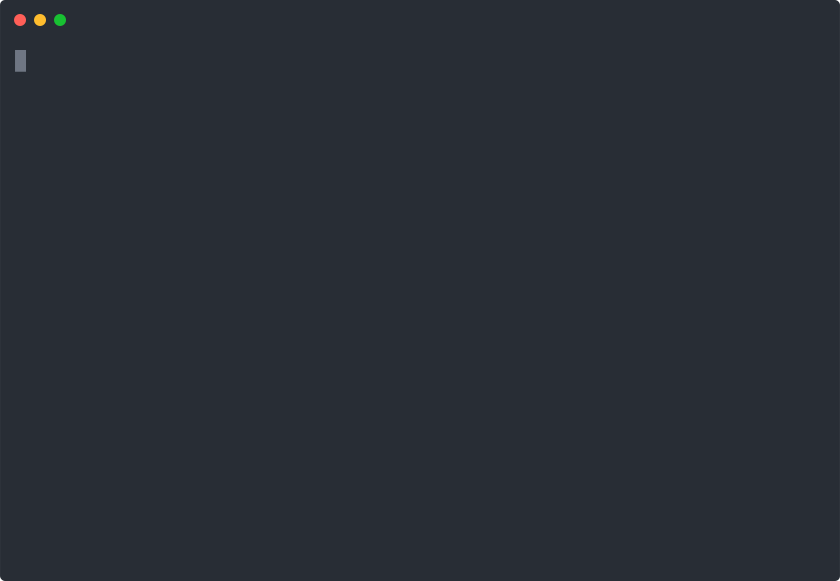

# importmap.vim

> *bower.vim installed browser components with a package manager. importmap.vim installs them with nothing at all.*



In 2013, [bower.vim](https://github.com/patrickkettner/bower.vim) promised "get a library into my page without a toolchain" by shelling out from Vim to Node, npm, and Bower to download dependencies into `bower_components`.

In 2026, the web platform delivers that original promise natively via **ES modules + import maps + ESM CDNs** (`esm.sh`, `jsdelivr`, `unpkg`). **importmap.vim** manages the `<script type="importmap">` block inside your HTML document directly from inside Vim or Neovim.

It requires **zero runtime dependencies beyond `curl`**. No Node. No npm. No package manager. No build steps. No `node_modules`. The `<script type="importmap">` block inside your HTML file *is* your lockfile and your dependency tree.

---

## Installation

Works on Vim 8.1.0039 or later and Neovim (both are tested in CI). Install
with your plugin manager of choice

#### vim packages (vim 8+)

```sh
git clone https://github.com/patrickkettner/importmap.vim ~/.vim/pack/plugins/start/importmap.vim
```

#### [pathogen](https://github.com/tpope/vim-pathogen)

```sh
git clone https://github.com/patrickkettner/importmap.vim ~/.vim/bundle/importmap.vim
```

(for the native packages and pathogen installs, run `:helptags ALL` once so `:help importmap` works)

#### [vim-plug](https://github.com/junegunn/vim-plug)

```vim
Plug 'patrickkettner/importmap.vim'
```

#### [vundle](https://github.com/VundleVim/Vundle.vim)

```vim
Plugin 'patrickkettner/importmap.vim'
```

---

## Quickstart

Open your `index.html` (or run from anywhere within your project) and install your browser components:

```vim
:ImportMap install canvas-confetti lodash-es@^4.17
```

`importmap.vim` queries the npm registry via `curl`, resolves the versions, and inserts (or updates) a clean, formatted `<script type="importmap">` block in your `<head>` before any module scripts:

```html
<script type="importmap">
{
  "imports": {
    "canvas-confetti": "https://esm.sh/canvas-confetti@1.9.3",
    "canvas-confetti/": "https://esm.sh/canvas-confetti@1.9.3/",
    "lodash-es": "https://esm.sh/lodash-es@4.17.21",
    "lodash-es/": "https://esm.sh/lodash-es@4.17.21/"
  }
}
</script>
```

## Commands

```
:ImportMap install <pkg>[@spec]   resolve and add packages (tab-completes names and versions)
:ImportMap rm <pkg>               remove packages and their prefix mappings
:ImportMap update [<pkg>]         bump mapped packages within their caret range
:ImportMap outdated               compare mapped versions against the registry (quickfix)
:ImportMap list                   show every mapped package, version, and CDN
:ImportMap sync                   scan the buffer for bare imports and install what is missing
:ImportMap cdn <provider>         rewrite every mapping onto esm.sh, jsdelivr, or unpkg
:ImportMap integrity              compute SRI hashes for exact-URL mappings
:ImportMap doctor                 sanity-check curl, openssl, target file, and cache
```

`:Bower` works as an alias for `:ImportMap`, for old times' sake.

### Auto-Sync Specifiers (`:ImportMap sync`)

Write the bare imports you wish existed in your JavaScript or TypeScript buffer:

```js
import confetti from "canvas-confetti";
import { debounce } from "lodash-es/debounce";
import { LitElement } from "@lit/reactive-element";
```

Run `:ImportMap sync`. `importmap.vim` scans your buffer, detects the missing dependencies, reduces subpaths (`lodash-es/debounce` is installed as `lodash-es`), and prompts to install all of them at `latest` in one shot (`:ImportMap! sync` skips the prompt).

---

## The bower.vim Heritage

Thirteen years ago, `bower.vim` brought frontend package management into the editor. But doing so required an entire local toolchain (`node`, `npm`, `git`, and `bower`) just to pull down JavaScript files.

`importmap.vim` is the spiritual successor built for the modern web. It strips away the toolchain entirely. By using standard browser ES modules and globally distributed ESM CDNs, your editor only needs an HTTP client (`curl`) and text manipulation abilities to turn bare specifiers into instant, production-ready imports.

---

## Configuration

Set any of these `g:` variables in your `vimrc` or `init.vim` / `init.lua`:

| Variable | Default | Description |
| :--- | :--- | :--- |
| `g:importmap_cdn` | `'esm.sh'` | CDN backend: `'esm.sh'`, `'jsdelivr'`, or `'unpkg'`. |
| `g:importmap_prefix_mappings` | `1` | Automatically write trailing-slash prefix mappings (`"pkg/"`) alongside exact mappings. **Default ON**. |
| `g:importmap_registry_url` | `'https://registry.npmjs.org'` | Override npm registry metadata base URL. |
| `g:importmap_html_candidates` | `['index.html', 'public/index.html', 'src/index.html', 'www/index.html']` | Search order for the target HTML file relative to project root. |
| `g:importmap_target` | `''` | Explicit path to target HTML or `.json` file (`b:importmap_target` for buffer overrides). |
| `g:importmap_root_markers` | `['.git', '.hg', 'package.json', 'index.html']` | Project root detection markers when searching upwards from current file. |
| `g:importmap_curl` | `'curl'` | Path or binary name for `curl`. |
| `g:importmap_timeout` | `10` | Per-request HTTP timeout in seconds (`curl --max-time`). |
| `g:importmap_cache_ttl` | `300` | Registry response cache time-to-live in seconds. |
| `g:importmap_cache_dir` | `''` | Override the registry cache directory (defaults to a per-user cache path). |
| `g:importmap_indent` | `2` | Number of spaces per indent level inside serialized import map JSON. |
| `g:importmap_esm_sh_flags` | `''` | Raw query flags appended to `esm.sh` URLs (e.g. `'?bundle'` or `'?dev'`). |
| `g:importmap_openssl` | `'openssl'` | Path or binary name for `openssl`, used only by `:ImportMap integrity`. |
| `g:importmap_sync` | `0` | Run installs synchronously (blocks the editor; useful in scripts and batch contexts). |
| `g:importmap_log` | `''` | Path to optional timestamped diagnostic log file. |

---

## CDN Trade-Offs

You can switch your import map's CDN provider anytime using `:ImportMap cdn {provider}` (`esm.sh`, `jsdelivr`, or `unpkg`).

| Provider | Bare Specifier URL | Prefix URL | Transitive Dependency Behavior |
| :--- | :--- | :--- | :--- |
| `esm.sh` *(default)* | `https://esm.sh/pkg@ver` | `https://esm.sh/pkg@ver/` | **Server-side rewriting.** The CDN server rewrites internal bare imports inside the module to `esm.sh` URLs on the fly. No client-side transitive resolution is needed. |
| `jsdelivr` | `https://cdn.jsdelivr.net/npm/pkg@ver/+esm` | `https://cdn.jsdelivr.net/npm/pkg@ver/` | `+esm` serves a bundled module with dependencies handled. However, the prefix URL serves **raw** package files. Raw JS loaded via the prefix may contain bare imports that fail unless separately mapped. |
| `unpkg` | `https://unpkg.com/pkg@ver?module` | `https://unpkg.com/pkg@ver/` | `?module` rewrites bare specifiers to `unpkg` URLs. Same raw-prefix asymmetry as jsDelivr for prefix imports. |

---

## Subresource Integrity (SRI)

You can secure your dependencies against tampering using cryptographic hashes. Run `:ImportMap integrity` to compute and write SHA-384 hashes for every exact-URL mapping in your import map:

```html
"integrity": {
  "https://esm.sh/canvas-confetti@1.9.3": "sha384-abc123..."
}
```

SRI hashes pin exact response bytes, so switching CDNs or updating package versions invalidates existing hashes. Run `:ImportMap integrity` again after modifying your mappings.

---

## FAQ

### Where's `node_modules`?
**There isn't one. That's the point.**
Modern browsers download ES modules directly over HTTP via the import map. Nothing is downloaded to your local disk during installation, and you don't need a multi-gigabyte `node_modules` folder.

### How do I import subpaths or CSS/assets (`lodash-es/debounce` or `pkg/logo.png`)?
When `g:importmap_prefix_mappings` is enabled (the default), installing `canvas-confetti` creates both `"canvas-confetti"` and `"canvas-confetti/"`. That trailing-slash prefix mapping allows the browser to resolve any subpath directly under the package URL:

```js
// Subpath JS module import
import { debounce } from "lodash-es/debounce";

// Asset URL resolution in the browser via import.meta.resolve
const iconUrl = import.meta.resolve("canvas-confetti/assets/confetti.png");
```

### Can I use `importmap.vim` with Deno or a backend build step?
Yes. If `g:importmap_target` or `b:importmap_target` points to a `.json` file (`import_map.json`), `importmap.vim` operates in **JSON-file mode**, manipulating the JSON file directly without HTML `<script>` tags.

---

## License

MIT (see LICENSE-MIT.txt)
